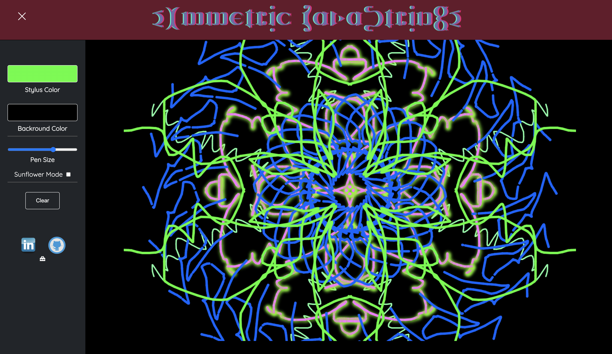
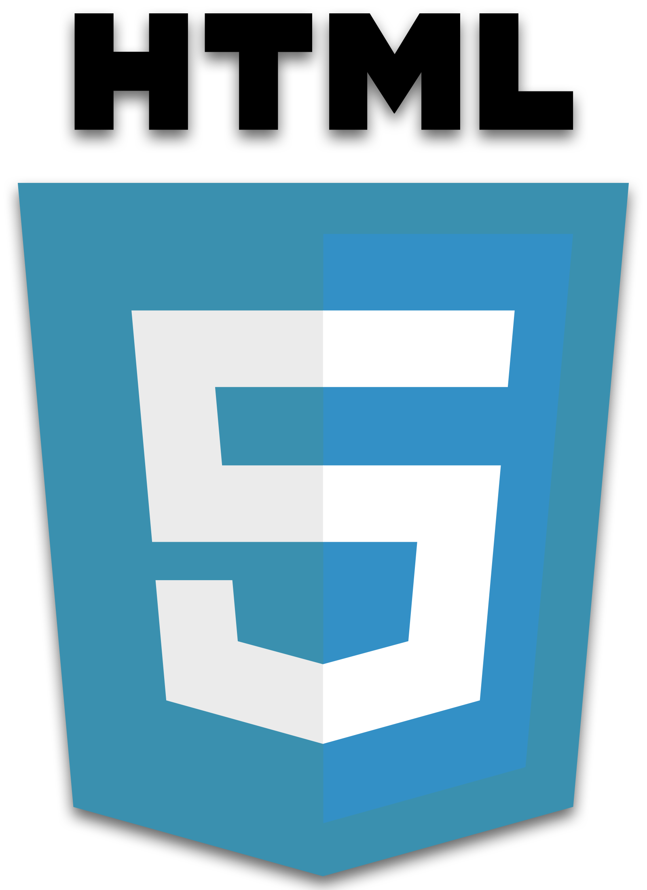
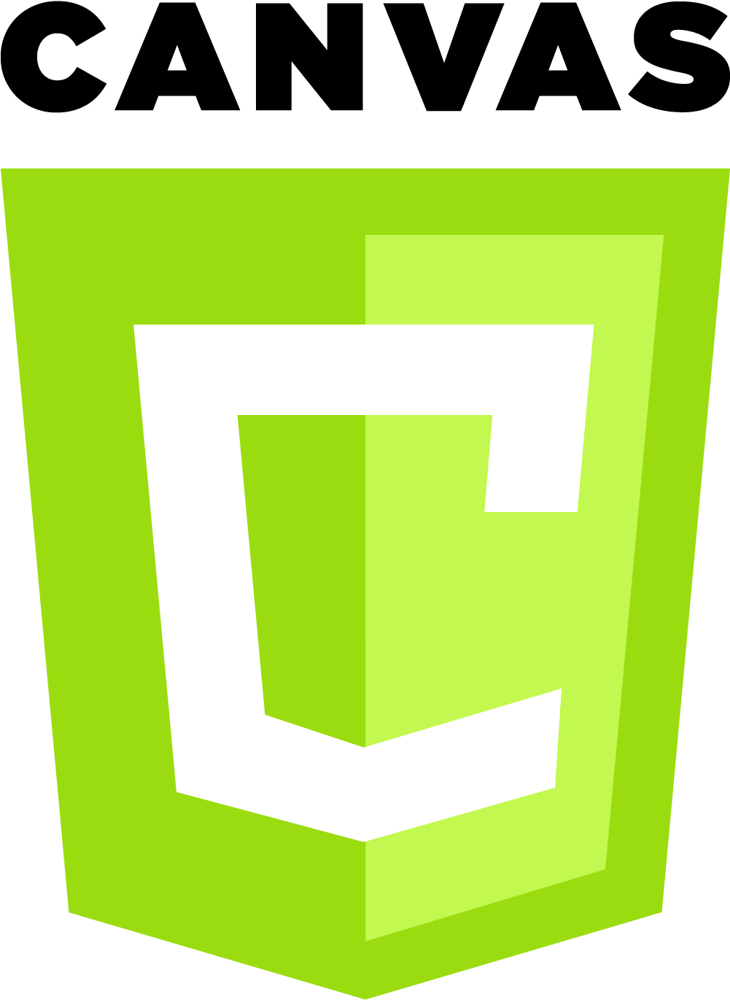

# Symmetric JavaStrings
Lines are a fundamental element of design. In drawing, they are the main tool of expression. Symmetric JavaStrings is a drawing application that uses radial symmetry and mathematical principles, allowing users to create beautiful designs with minimal effort.



## Features
 + Stylus color selection
 + Background color selection
 + Canvas reset
 + Pen width adjustment
 + Radial mode with size selector
 + Responsive Sidebar

## Technologies
<a href="#"></a>
<a href="#"></a>
<a href="#"></a>
<a href="#"></a>
<a href="#"></a>
   
  
## Implementation 

### Canvas
A `Canvas` is rendered with preset settings when the browser is loaded.

```javascript
// canvas.js
class Canvas {
  constructor() {
    this.canvas = document.getElementById("canvas");           // canvas element
    this.clear = document.getElementById("clear");             // clear button
    this.color = document.getElementById('stylus-color');      // drawing color
    this.bgColor = document.getElementById('background-color');// background color
    this.penWidth = document.getElementById('pen-width');      // pen width
    this.spiro = document.getElementById('spiro');             // radial selector
    this.slicer = document.getElementById('divisions');        // radial divisions

    //canvas setting
    this.canvas.width = window.innerWidth - 250;            
    this.canvas.height = window.innerHeight - 100;
    this.ctx = this.canvas.getContext("2d");
  }
}
```

### Cursor tracking
Event Listeners are set on `onpointermove`, `onpointerdown`, `onpointerup`, and `onpointerout` to track mouse movement and clicks on `Canvas`.

```javascript
// canvas.js
    this.canvas.onpointermove = this.handleMove.bind(this);  
    this.canvas.onpointerdown = this.handleDown.bind(this);
    this.canvas.onpointerup = this.stopDrawing.bind(this);  
    this.canvas.onpointerout = this.stopDrawing.bind(this);
```

### Drawing
Coordinates are grabbed from `MouseEvent`s and passed to a function that renders a line.

```javascript
// canvas.js 
  getCoordinates(e){
    [this.startX, this.startY] = [this.endX , this.endY];
    this.endX = e.clientX - this.canvas.offsetLeft;
    this.endY = e.clientY - this.canvas.offsetTop;
  }

  drawLine(startX = this.startX, startY = this.startY, endX= this.endX, endY = this.endY) {
    this.ctx.beginPath();
    this.ctx.moveTo(startX , startY );  
    this.ctx.lineTo(endX, endY);
    this.ctx.stroke();
    this.ctx.closePath();
    this.ctx.restore(); 
  }
```

### Cartesian Plane Manipulation
There are 2 drawing modes.
 + `Reflection`: which renders drawings reflected at various points across the X and Y axis as if it were mirrored. 
 + `Radial Rotation`: apply a given amount of 'slices' to a circle, and replacing coordinates with X\` and Y\` with their angular equivalents
```javascript
  // canvas.js
  
  //reflected Y across X axis
  a_ = this.width - startX; b_ = this.height - startY;
  c_ = this.width - endX; d_ = this.height - endY;
  this.ctx.moveTo(a_, b_);
  this.ctx.lineTo(c_, d_);

  // inverse Y quadrant bottom
  a_ = this.width / 2 - this.height / 2 + startY; 
  b_ = this.width / 2 + this.height / 2 - startX;
  c_ = this.width / 2 - this.height / 2 + endY; 
  d_ = this.width / 2 + this.height / 2 - endX;
  this.ctx.moveTo(a_, b_);
  this.ctx.lineTo(c_, d_);

  // radial manipulation
  if (this.spiroClick()) {
    let sliced = this.sliceCount()

    for(let i = 2; i <= sliced ; i++) {
      this._start += 360 / sliced;
      let rP = this.rotate({x: startX, y: startY}, this.center, this._start);
      let rC = this.rotate({x: endX, y: endY}, this.center, this._start);
      this.spiralDraw(rP, rC, lineWidth, strokeStyle);
    }
  }

  rotate(p1, p2, a) {
    a = this.d2r(a);
    let xr = (p1.x - p2.x) * Math.cos(a) - (p1.y - p2.y) * Math.sin(a) + p2.x;
    let yr = (p1.x - p2.x) * Math.sin(a) + (p1.y - p2.y) * Math.cos(a) + p2.y;
    return {x : xr, y : yr};
  }
```


